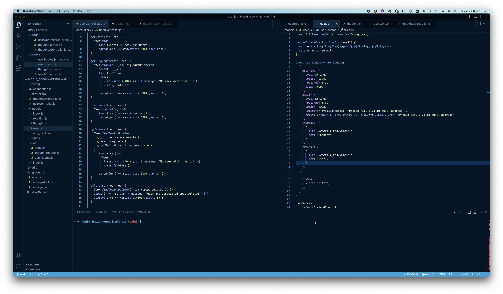

# Social Network API

This is the back end of **a social network site**.

## Table of Contents

- [Background](#background)
- [Install](#install)
- [Usage](#usage)
- [Screenshot](#screenshot)
- [Maintainers](#maintainers)
- [Contributing](#contributing)
- [Contributors](#contributors)
- [License](#license)

## Background

*To understand the fundamental architecture of social network sites,* we were instructed to build the back end of one. This may not be applicable right out of the box, but was a good exercise as a starting point for understanding how social media sites work.

## Install/Link to Webpage 🔗 

Check out the link to the walkthrough video:

https://youtu.be/PHc6rUg_Nyc

And here's the repo link!:

https://github.com/dbedrossian/Mod18_Social-Network-API

## Usage

This is being used as an assignment project.

## Screenshot

## Maintainers

[@Danny Bedrossian](https://github.com/dbedrossian).

## Contributing

Feel free to dive in! [Open an issue](https://github.com/dbedrossian/standard-readme/issues/new) or submit PRs.

## Contributors

Thanks to tutor Dennis Itua for an amazing explanation of how APIs work. Also thanks to the few ASKBCS tutors.

## License

© Danny Bedrossian